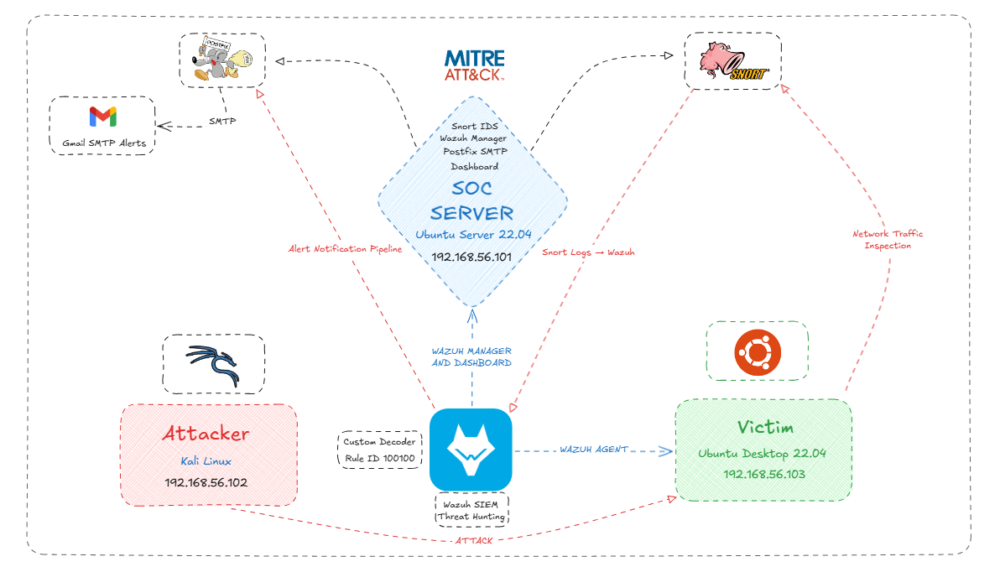
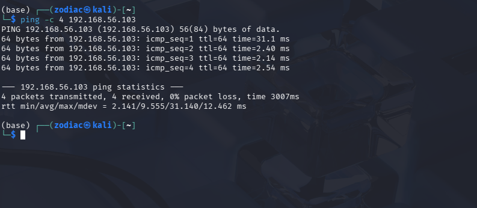
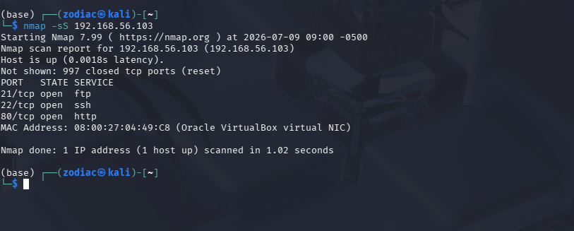
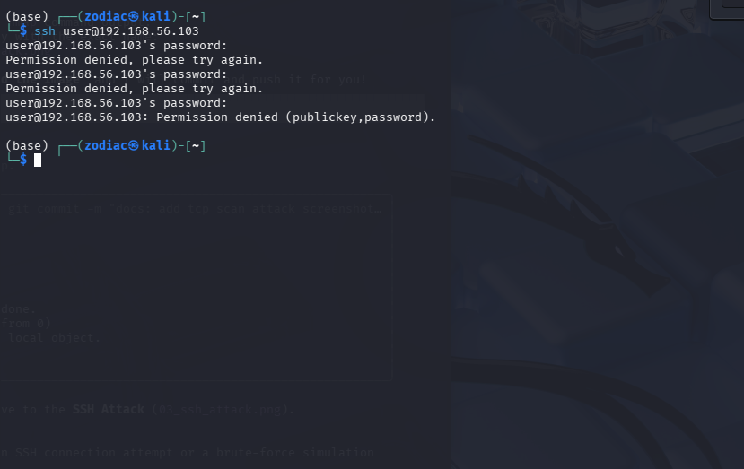

# SOC Detection Pipeline

A self-hosted SOC detection pipeline mapping real attack traffic to MITRE ATT&CK using Snort IDS + Wazuh SIEM, with automated email/PDF incident alerting.

## Tech Stack

## Architecture Overview
The lab consists of three virtual machines running on a VirtualBox host-only network (`192.168.56.x`):
- **SOC Server (192.168.56.101):** Runs Snort IDS, Wazuh Manager, and Postfix for alert relay.
- **Kali Attacker (192.168.56.102):** Used for generating controlled attack traffic.
- **Victim (192.168.56.103):** An Ubuntu machine running the Wazuh Agent.

## How it Works
1. Attack traffic is generated from the Kali machine.
2. The Snort IDS detects the traffic based on custom rules and writes an alert to `alert_fast.txt`.
3. The Wazuh Manager decodes the alert via `snort3-alert-fast`.
4. The alert matches base rule `100100`, and child rules append relevant MITRE ATT&CK tags.
5. If the alert level is >= 12, Postfix triggers an email containing a PDF incident report.

## MITRE ATT&CK Coverage

| Rule ID | Snort SID | Detection | MITRE Technique | Tactic | Status |
| :--- | :--- | :--- | :--- | :--- | :--- |
| 100101 | 1000001 | ICMP Ping | T1046 | Discovery | Validated |
| 100102 | 1000003 | TCP Scan | T1046 | Discovery | Validated |
| 100103 | 1000002 | SSH Connection Attempt | T1021.004 | Lateral Movement | Validated |

## Setup Instructions

### 1. Environment Preparation
- Install VirtualBox.
- Create three VMs (SOC Server, Kali, Victim) on a Host-Only adapter.
- Configure static IP addresses (e.g., `192.168.56.x/24`).

### 2. SOC Server Installation
- **Snort IDS:** Install Snort 3 and configure interface monitoring.
- **Wazuh Manager:** Install and configure the manager to receive alerts.
- **Postfix:** Configure SMTP for automated alert relay.

### 3. Agent & Rules Configuration
- **Wazuh Agent:** Install on the Victim machine and connect to the Manager.
- **Snort Rules:** Copy custom rules to `/usr/local/etc/snort/rules/local.rules`.
- **Wazuh Rules:** Add custom decoders and rules to `/var/ossec/etc/rules/local_rules.xml`.

### 4. Verification
- Use the Kali machine to generate traffic and confirm alerts appear in the Wazuh dashboard and email notifications.

## Known Issues / Lessons Learned
- Tuned out `arp_spoof` and `port_scan` false positives from Snort's built-in inspectors to reduce noise.
- Discovered and noted a packet-truncation warning ("IPv4 datagram length > captured length") affecting content-based rule matching.

## Roadmap / Future Work (NOT YET BUILT)
- MITRE T1110 Brute Force detection (SSH)
- Wazuh Active Response for automated IP blocking (SOAR-lite)
- Wazuh File Integrity Monitoring for persistence/defense evasion detection (T1053, T1098, T1070)
- TheHive + Cortex for incident case management
- Azure cloud migration

## Project Screenshots

### Network Architecture

### Attack Simulation

### Detection & Logs

### Incident Alerting (SMTP/PDF)

