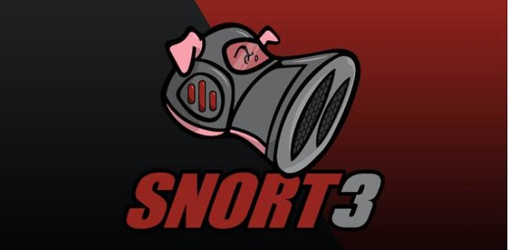

# SOC Detection Pipeline

A self-hosted Security Operations Center (SOC) detection pipeline mapping real attack traffic to **MITRE ATT&CK** techniques using **Snort IDS** and **Wazuh SIEM**, featuring automated incident response through email and PDF reporting.

---

## 📑 Table of Contents
- [Tech Stack](#tech-stack)
- [Architecture Overview](#architecture-overview)
- [How it Works](#how-it-works)
- [MITRE ATT&CK Coverage](#mitre-attck-coverage)
- [Setup Instructions](#setup-instructions)
- [Known Issues & Lessons](#known-issues--lessons)
- [Roadmap](#roadmap)
- [Project Screenshots](#project-screenshots)

---

## 🛠 Tech Stack

  <table align="center" border="0">
    <tr>
      <td align="center" width="150">
         
        <strong>Snort 3</strong>
      </td>
      <td align="center" width="150">
         
        <strong>Wazuh</strong>
      </td>
      <td align="center" width="150">
         
        <strong>ATT&CK</strong>
      </td>
      <td align="center" width="150">
         
        <strong>Postfix</strong>
      </td>
    </tr>
  </table>

---

## 🏗 Architecture Overview
The lab consists of three virtual machines running on a VirtualBox host-only network (`192.168.56.x`):

*   **SOC Server (192.168.56.101):** Runs Snort IDS, Wazuh Manager, and Postfix for alert relay.
*   **Kali Attacker (192.168.56.102):** Used for generating controlled attack traffic.
*   **Victim (192.168.56.103):** An Ubuntu machine running the Wazuh Agent.

## ⚙️ How it Works
1.  **Attack:** Traffic generated from the Kali machine.
2.  **Detection:** Snort IDS detects malicious traffic and logs to `alert_fast.txt`.
3.  **Correlation:** Wazuh Manager decodes the alert via `snort3-alert-fast`.
4.  **Enrichment:** Alert matches base rule `100100`, child rules append relevant **MITRE ATT&CK** tags.
5.  **Alerting:** If alert level >= 12, Postfix triggers an email with a PDF incident report.

## 🛡 MITRE ATT&CK Coverage

| Rule ID | Snort SID | Detection | Technique | Tactic | Status |
| :--- | :--- | :--- | :--- | :--- | :--- |
| 100101 | 1000001 | ICMP Ping | T1046 | Discovery | Validated |
| 100102 | 1000003 | TCP Scan | T1046 | Discovery | Validated |
| 100103 | 1000002 | SSH Connection Attempt | T1021.004 | Lateral Movement | Validated |

---

## 🚀 Setup Instructions

### 1. Environment Preparation
*   Install VirtualBox.
*   Create three VMs on a Host-Only adapter.
*   Configure static IP addresses (e.g., `192.168.56.x/24`).

### 2. Component Installation
*   **Snort IDS:** Install Snort 3 and configure interface monitoring.
*   **Wazuh Manager:** Install and configure the manager.
*   **Postfix:** Configure SMTP for automated alert relay.

### 3. Agent & Rules
*   Install Wazuh Agent on the Victim machine.
*   Add custom rules to Snort and Wazuh (`local.rules`, `local_rules.xml`).

### 4. Verification
*   Use Kali to generate traffic and confirm alerts in the Wazuh dashboard.

---

> **💡 Known Issues & Lessons**
> * Tuned out `arp_spoof` and `port_scan` false positives to reduce noise.
> * Discovered packet-truncation issues affecting content-based rule matching.

## 📸 Project Screenshots

### Network & Simulation
| Architecture | ICMP Attack | TCP Scan |
| :---: | :---: | :---: |
|  |  |  |

### Detection & Incident Response
*   **Snort Logs:** `screenshots/04_snort_logs.png`
*   **Wazuh Alerts:** `screenshots/05_wazuh_alerts.png`
*   **Email Alert:** `screenshots/06_email_alert.png`
*   **PDF Report:** `screenshots/07_pdf_report.png`
